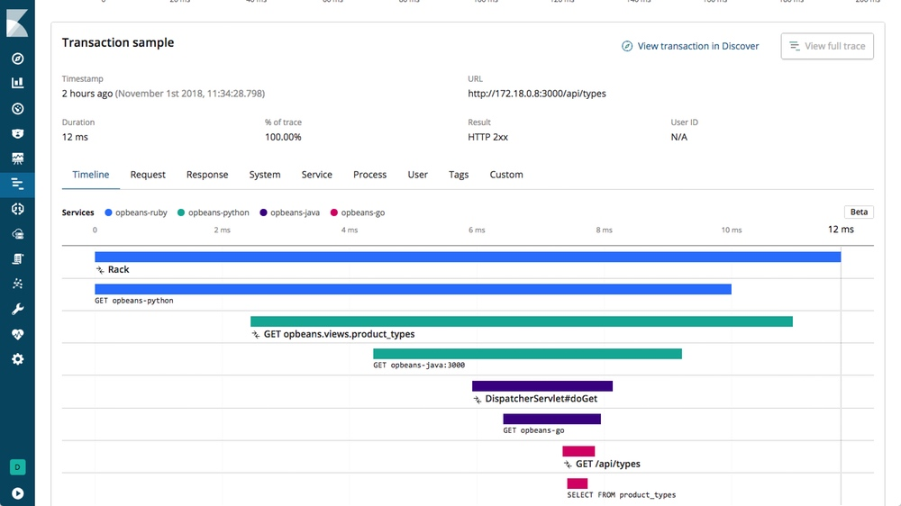
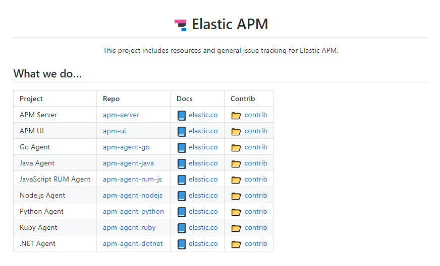

# Requirements for monitoring distributed system

## One standard for the whole system would be great

* To understand how the distributed system is connected
* Allow easy root cause analysis
* visibility of health
* visibility of performance
* notification service
* support for different development runtimes like .net, java, javascript, ...
* support for different hosting environments like, kubernetes, docker, linux, windows,...
* centralized storage and visibility system
* displays version of each element in the system

## LOGS

### Centralized storage and search for log files

#### Log types

* Windows event logs
* Unix event logs

## Metrics

* System Performance counter
  * CPU utilization
  * Memory usage
  * I/O performance

* Application Performance counter
  * Users connected
  * Jobs per second
  * transactions per second
  * CPU utilization
  * Memory usage
  * I/O performance

## Distributed Tracing

<https://www.elastic.co/blog/distributed-tracing-opentracing-and-elastic-apm>

* Get call chain over service boundaries
  * From a Angular frontend running in a browser (see Elastic RUM)
  * to an api gateway into docker into
  * to some backed .net core or java services
  * and reading and writing data in a database

* Latency
* Stacktrace

### Open Source Tracers

* Zipkin
* Jaeger
* Elastic APM

## Security

* Don't write password to logs

## Solution for our Stack

## Elastic APM support

<https://github.com/elastic/apm>

## Further reading

* Observability with the Elastic Stack
  <https://www.elastic.co/blog/observability-with-the-elastic-stack>

* The world of microservices
  <https://www.elastic.co/blog/distributed-tracing-opentracing-and-elastic-apm>

* Tracing for Browser Apps with Elastic RUM
  <https://www.elastic.co/guide/en/apm/server/current/rum.html>
